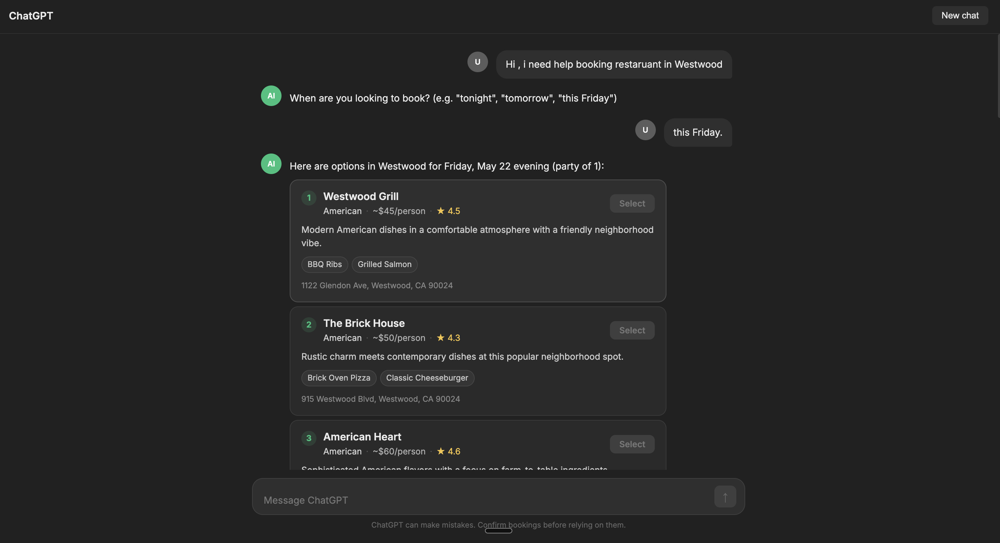

# ChatGPT Life OS — Contextual Action Engine

MGMT 276 | UCLA Anderson MBA

## What this repo is

A functional prototype and supporting documentation for the ChatGPT Life OS Contextual Action Engine — a behaviorally-grounded agentic feature that moves users from intent to completed action inside a single conversation.

## Deliverables

| Folder | Deliverable |
|---|---|
| `prototype/` | Working agentic application |
| `docs/source_of_truth.md` | Final spec — system prompts, data schemas, agent loop |
| `docs/pr_faq.md` | Narrative & PR-FAQ |
| `appendix/eval/` | Eval rubric, golden dataset, pattern definitions, results |
| `appendix/user_interviews/` | User interview guide and consolidated findings |

## Reference docs

Background and assignment documents are in `docs/reference/`.

## Demo

[Watch demo video](https://www.loom.com/share/97e320bc0f024e55a1de36d0ee624992)

## How to run the prototype

See `prototype/README.md`.
